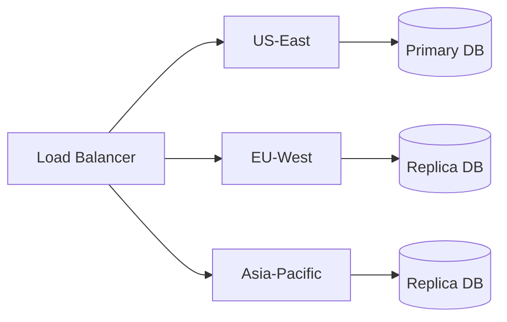

# How We Achieved 99.9% Uptime

Reliability is at the core of what we do at Upgrade. When your content management system is the backbone of your digital presence, downtime is simply not an option. Here's how we've achieved and maintained 99.9% uptime over the past year.

## Our Infrastructure Architecture

### Multi-Region Deployment

We deploy across multiple geographic regions to ensure:

- **Low latency** for users worldwide
- **Automatic failover** if one region experiences issues
- **Disaster recovery** capabilities



### Container Orchestration

```typescript
import { defineCollection } from 'astro:content';
import { glob } from 'astro/loaders';
import { z } from 'astro/zod';

const blog = defineCollection({
    loader: glob({ pattern: "**/*.md", base: "./src/content/blog" }),
    schema: z.object({
        title: z.string(),
        pubDate: z.date(),
        author: z.string(),
        category: z.string(),
        excerpt: z.string().optional(),
        readTime: z.string().optional(),
        heroImage: z.string().optional(),
    }),
});

export const collections = { blog };
```

We use Kubernetes for container orchestration, which gives us:

- Automatic scaling based on demand
- Self-healing capabilities
- Rolling updates with zero downtime

## Monitoring Stack

### Real-Time Metrics

Our monitoring stack includes:

| Tool | Purpose |
|------|---------|
| Prometheus | Metrics collection |
| Grafana | Visualization |
| PagerDuty | Alert management |
| OpenTelemetry | Distributed tracing |

### Key Metrics We Track

1. **Response time** (p50, p95, p99)
2. **Error rate** by endpoint
3. **Database query performance**
4. **Memory and CPU utilization**

## Deployment Strategy

### Blue-Green Deployments

We use blue-green deployments to eliminate downtime during releases:

1. Deploy new version to "green" environment
2. Run automated tests
3. Switch traffic gradually (10%, 50%, 100%)
4. Keep "blue" ready for instant rollback

### Feature Flags

Feature flags allow us to:
- Deploy code without enabling features
- Roll out features to specific users first
- Quickly disable problematic features

## Lessons Learned

Over the years, we've learned that:

> "The best incident is the one that never happens."

Prevention is always better than response. We invest heavily in:
- Chaos engineering exercises
- Regular disaster recovery drills
- Comprehensive testing at all levels

## Conclusion

Achieving high availability requires a combination of good architecture, robust monitoring, and disciplined processes. We continue to improve our systems every day to provide you with the reliability you deserve.
