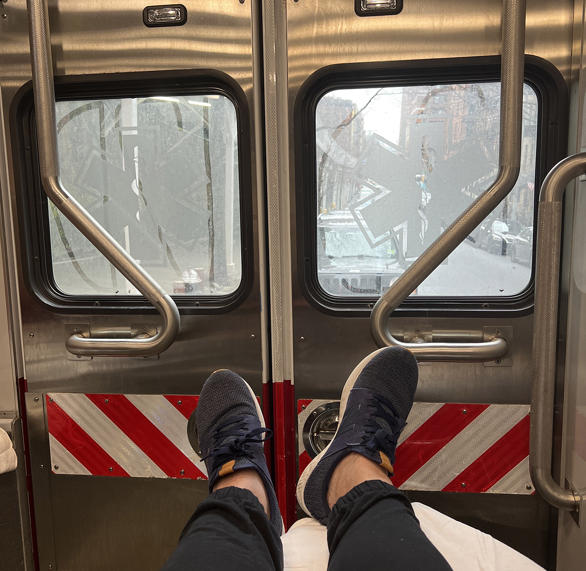
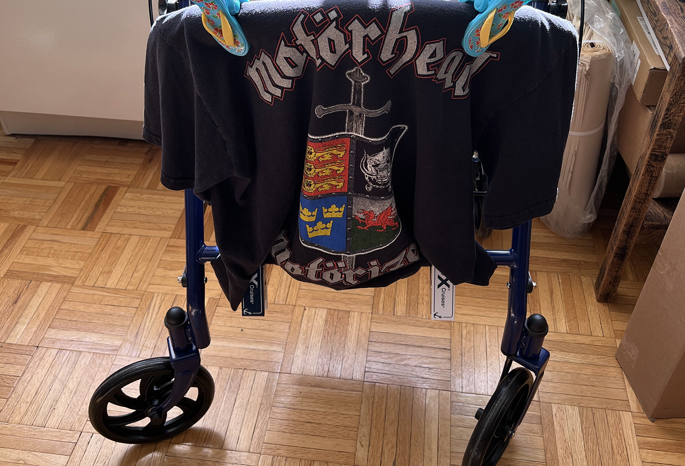
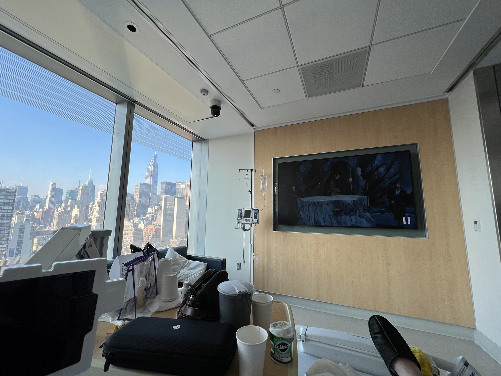
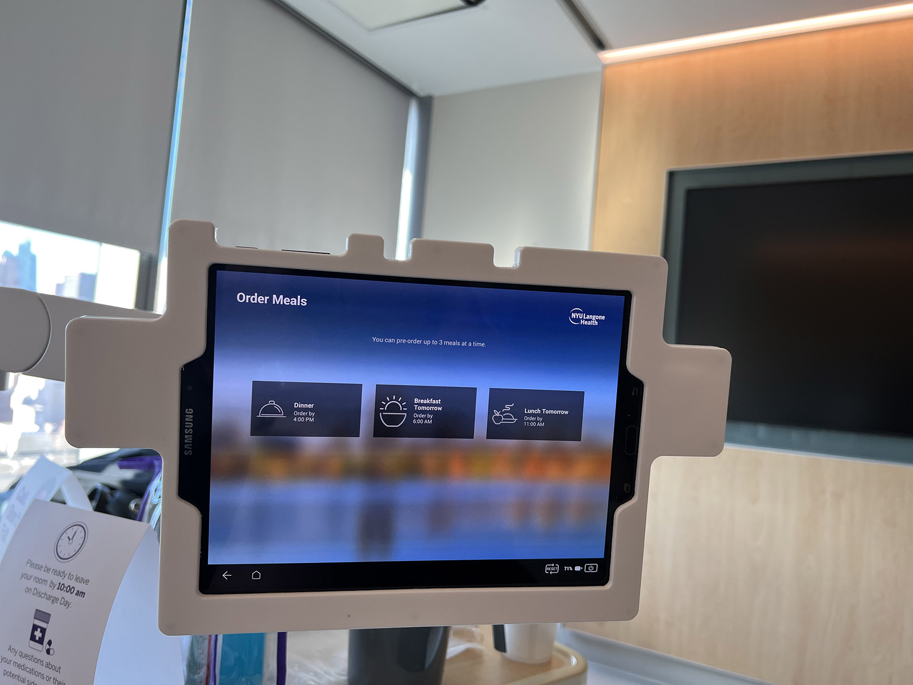

# Medical Update

Last Thursday, 9 days ago, I had some life firsts. I couldn't walk, because my legs basically didn't work. That was new. Had to call 911, for the first time, because if I couldn't walk I couldn't stay in our apartment. I was rolled out into an ambulance. First ambulance ride, at least for me as the primary passenger.

<!--truncate-->

This is after gradually losing muscle strength since late December and early January. It started with needing two hands to pour coffee because I couldn't lift the caraffe. Things progessively got worse, to the point where I got a rollator so I could go further than a block from our apartment. I decorated it with a Motorhead shirt for a night out.

I was diagnosed with Psoriatic Arthritis a year ago and started medications to deal with that. At its worst, the arthritis also caused some hand weakness, so I figured it was the same thing. I was switching PsA meds at the same time.

By late January, it was obviously not the arthritis. I tried getting into a neurologist, but the first availabilities were around June/July. Another doctor made some calls and got an appointment for 2/28, so I just needed to hold out for a few weeks.

By last Wednesday, getting in and out of bed was difficult, and I could only type about one sentence before I had to stop. Needed two hands to brush my teeth. That kind of thing.

Thursday morning, it took a few minutes to actually stand up, then I immediately fell. On the way down, there was a loud crack from my leg. After laying there for a bit, it seemed like I maybe sprained my ankle, but nothing was broken. I crawled out to the rollator, then sat to figure out what to do next.

I couldn't walk. I couldn't safely get into our bathroom. So, staying in the apartment seemed like a bad plan. We wound up calling 911 and getting an ambulance.

Thankfully, I was able to choose hospitals, so I went to NYU. All of my doctors are in the NYU system, and their Neurology program is ranked top in the country, so I figured that was the best place to go.

That was Thursday morning. There were no rooms, so I stayed in the ER until Friday afternoon, but other than that, care was excellent. In total, I had a spine MRI, CT scan, chest X-Ray, lumbar puncture (would not recommend that), and at least 10 blood test draws. Friday afternoon, I was moved into the 2nd best hospital room I've ever seen, and only because the other one was 2-3 times as big. Everything else about this room was better. The view, 65" TV, tablet for controlling the TV, ordering food, controlling lights and temp, etc.

Originally I was going to stay through Tuesday, but recovery was so quick they let me out Sunday. While I was certainly happy to go home, by Sunday I was basically fine. That room would be pretty amazing if you could get around easily :)

Anyway, after all that, the diagnosis was CIDP. It's relatively rare, and probably caused by whatever respiratory virus I had mid December. I had 3 infusions of IVIG: Friday night, Saturday night, and Sunday afternoon. After the first one, Saturday morning, my hands were useful again, and I could get around with the walker. On Sunday, I could walk without the walker.

On Tuesday, 2/28, I went to that Neurology appointment. The doctor said it might be AIDP, which means I may be done with treatment altogether. My hand and leg strength as of Wednesday, 6 days after the fall, seemed completely back to normal (except atrophy, which should be built back up quickly). 

So, Thursday, can't walk or use my hands. 5-6 days later, back to normal. It's been a wild couple weeks.

Please donate blood. That's how they make IVIG. Huge thanks to the NYU medical team.